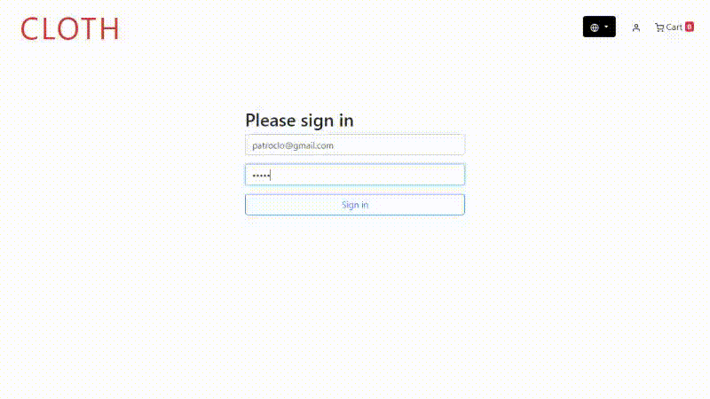

# Express-Cart

## GUI test automation academy project with Playwright

Welcome to the GUI Express-Cart Test Automation project! This project was developed as part of an academy activity to demonstrate the use of Playwright as a GUI Test Automation tool for an e-commerce web application.

## Description

Express-Cart is a simple e-commerce application built with Express.js, Node.js, and MongoDB. It allows users to browse products, add them to their cart, and place orders. The source code of the application has been liberated for the creators to openly use.

## Getting Started with Docker

To get started with Express-Cart using Docker, follow these steps:

1. Clone this repository to your local machine.
2. Ensure you have Docker installed on your system.
3. Navigate to the root directory of the cloned repository.
4. Build the Docker image using the provided Dockerfile:
   `docker build -t express-cart`
5. Once the image is built, you can run the container:
   `docker run -p 3000:3000 express-cart`
   This command will start the Express-Cart application inside a Docker container and map port 3000 of the container to port 3000 on your host machine.
6. Visit `http://localhost:3000` in your browser to access Express-Cart.

## Let's automate tests for some specific GUI components of Express-Cart.

1. Design the test cases using the appropriate black box technique.
2. Implement automation for the selected GUI test cases using PlayWright in TypeScript.
3. Execute the automation

### This is what the automation looks like.

